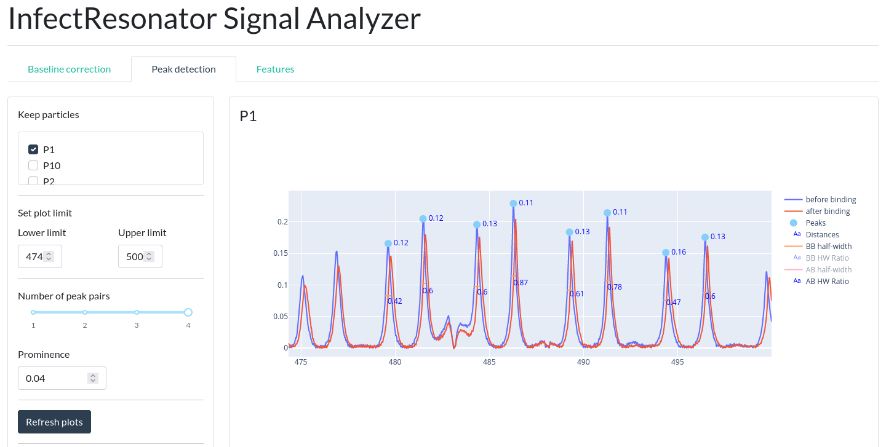
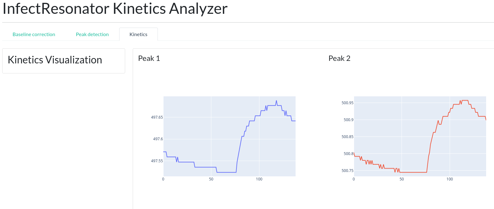
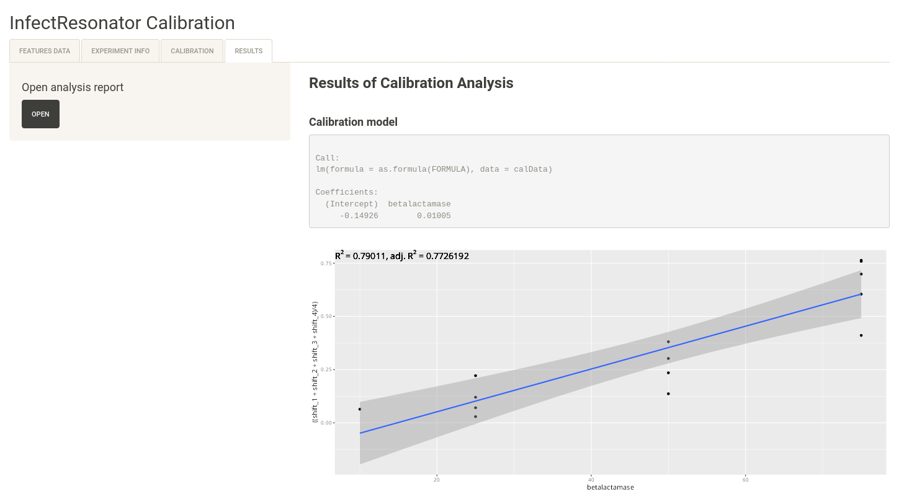

# InfectRes
This repository contains the prototype applications for kinetics and signal feature extraction from WGM-System measurements.

## Python requirements
    pip install -r requirements.txt
    
## R packages
* shiny
* shinythemes
* shinyjs
* DT
* ggplot2
* mgcv

## Python Applications preview

## Shiny Apllication preview

